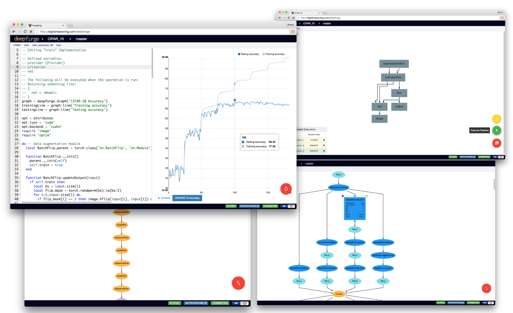

[](https://img.shields.io/badge/state-beta-yellow.svg)
[](./LICENSE)
[](https://travis-ci.org/deepforge-dev/deepforge)
[](https://gitter.im/dfst/deepforge?utm_source=badge&utm_medium=badge&utm_campaign=pr-badge&utm_content=badge)
[](https://waffle.io/deepforge-dev/deepforge)

**Notice**: DeepForge is still a work in progress and in beta! That being said, any contributions and/or feedback is greatly appreciated. If you have any questions, check out the [wiki](https://github.com/dfst/deepforge/wiki/) or drop me a line on the gitter!


# DeepForge

[](https://gitter.im/deepforge-dev/deepforge?utm_source=badge&utm_medium=badge&utm_campaign=pr-badge&utm_content=badge)
DeepForge is an open-source visual development environment for deep learning providing end-to-end support for creating deep learning models. This is achieved through providing the ability to design **architectures**, create training **pipelines**, and then execute these pipelines over a cluster. Using a notebook-esque api, users can get real-time feedback about the status of any of their **executions** including compare them side-by-side in real-time.



Additional features include:
- Graphical architecture editor
- Training/testing pipeline creation
- Distributed pipeline execution
- Real-time pipeline feedback
- Collaborative editing
- Automatic version control.
- Facilitates defining custom layers 

## Quick Start
Simply run the following command to install deepforge with its dependencies:

```
curl -o- https://raw.githubusercontent.com/dfst/deepforge/master/install.sh | bash
```

Or, if you already have NodeJS (v6) installed, simply run

```
npm install -g deepforge
```

Finally, start deepforge with `deepforge start`and navigate to [http://localhost:8888](http://localhost:8888) to start using DeepForge! For more, detailed instructions, check out the [wiki](https://github.com/dfst/deepforge/wiki/Installation-Guide).

**Note**: running deepforge w/ `deepforge start` will also require [MongoDB](https://www.mongodb.com/download-center?jmp=nav#community) to be installed locally.

Also, be sure to check out the other available features of the `deepforge` cli; it can be used to update, manage your torch installation, uninstall deepforge and run individual components!

## Additional Resources
- [Intro to DeepForge Slides](https://docs.google.com/presentation/d/10_y5O3gHXSATfjHVLJg7dOdrz-tAXNWjlxhJ5SlA0ic/edit?usp=sharing)
- [wiki](https://github.com/deepforge-dev/deepforge/wiki) containing overview, installation, configuration and developer information
- [Datamodel Developer Slides](https://docs.google.com/presentation/d/1hd3IyUlzW_TIPnzCnE-1pdz00Pw8WaIxYiOW_Hyog-M/edit#slide=id.p)
- [Examples](https://github.com/deepforge-dev/examples)

## Interested in contributing?
Contributions are welcome! Either fork the project and submit some PR's or shoot me an email about getting more involved!

Sponsored by [Digital Reasoning](http://www.digitalreasoning.com/)
